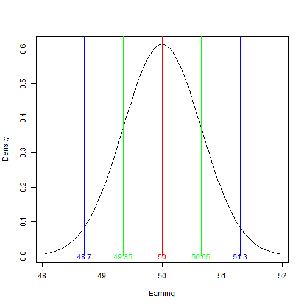

Earning prediction for coinflip game
========================================================
author: Igor Basov
date: November 18, 2015

Description
========================================================

This apps calcualtes the expected value for earnings in coinflip game.

As a result app shows expected value of your earning in given series of games.

Additionally it shows density plot for sample mean of such series.

It's completely interactive and recalculates output immediately after input being changed.

App structure
========================================================

App consists of side panel and two tabs.

- Side panel allows you to set up all the parameters you need.
- Result tab shows you current output in the form of text representation and plot.
- Help tab expains how the app works and gives you all neccessary information in order to use it.

Parameters
========================================================
App has several parameters to customize calculation:

- 'Probabilty of head' - probability that will show head for one flip
- 'You bet on' - choice that you make in every case of a series
- 'You win if you're right' - amount that you win if coin shows a side that you bet on
- 'You loose if you're wrong' - amount that you loose in another case
- 'Number of rounds' - number of coinflips with these parameters

Density plot
========================================================
This is an example of plot you can get in this app. Red line represents expected value, green lines - 1 standard divation out of the mean (68%), blue lines - 1 standard divation out of the mean (95% of cases).

 
